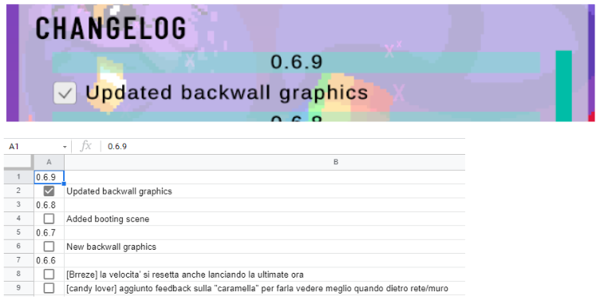
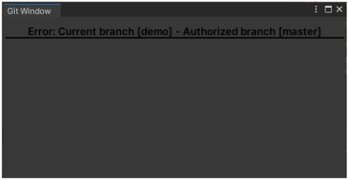
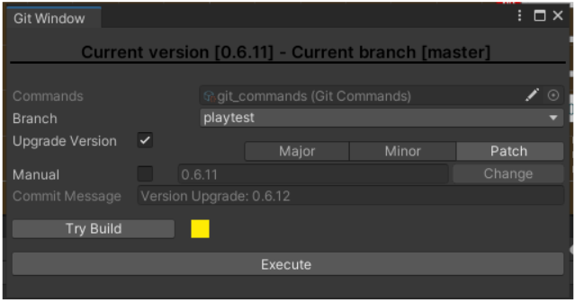

# cinic-tools

## Packages Structure
/Assets
    /Cinic Tools
    -- /Git Version Mantainer
    -- /Report Client

## Namespaces
CinicGames.Tools
    .Git
    .Report
    -- .Discord
    -- .HackNPlan
    .Utilities
        .Editor

***

# Documentazione

## CHANGELOG

### Google Sheets To Unity
- [Store](https://assetstore.unity.com/packages/tools/utilities/google-sheets-to-unity-73410)
- [Documentation](https://docs.google.com/document/d/1N0qw0OibqMp8SSA7Nwh7fhKObg2e-FSGQUeYr9-zN8Y/edit)

### Google Sheet Changelog

### Component

- **Sheet ID**: Id dello Spreadsheet del Google Sheet
- **Worksheet**: nome del foglio da andare a leggere e modificare
- **Key**: Tasto per aprire/chiudere il changelog 

### Tool
- Viene fatto il parse dello Spreadsheet e vengono istanziati dei Prefab per i
  **VersionTitle** e per i **Log**.

  
- I **Log** hanno un Toggle che vanno ad aggiornare lo Spreadsheet al cambio di
  valore
  

- Premendo il button Report è possibile mandare un report su Hack’n’Plan, con la
  possibilità di allegare anche uno screenshot della schermata del gioco
  

- Il Report va a creare un Task nella board Reports di Hack’n’Plan
  

- Il Titolo del task indicherà la versione della build e il titolo del report. La
  descrizione del task conterrà la descrizione del report. Lo screenshot del gioco
  verrà messo come allegato del task
  

## GIT

### Git Commit Utility

- [Source](https://gist.github.com/Marsgames/219afc01a1b6af1ed20c241ff449e574) 
  
### Settings

1. Unico branch da cui è possibile eseguire i comandi
2. Branch dove pushare la build di demo
3. Branch dove pushare la development build di playtest
4. Lista dei comandi git da eseguire. La label {branch} viene sostituita con il nome
   del branch
- Se non siamo nel Branch autorizzato non è possibile utilizzare il tool eseguire
  nessun comando
  

- Finestra del Tool se siamo nel branch autorizzato
  

- Tramite un dropdown è possibile cambiare branch dove pushare
  

- Tramite un Enum Flag è possibile scegliere che tipo di Upgrade stiamo facendo:
  Major, Minor, Patch

  

- Altrimenti è possibile cambiare manualmente il numero della versione
  

- Prima del push è consigliato testare se gli script vengono compilati prima della
  build. Il button Try Build fa partire la build per poi bloccarla subito dopo la
  compilazione degli script. Il colore del box accanto al button indica il successo o il
  fallimento della build
  
